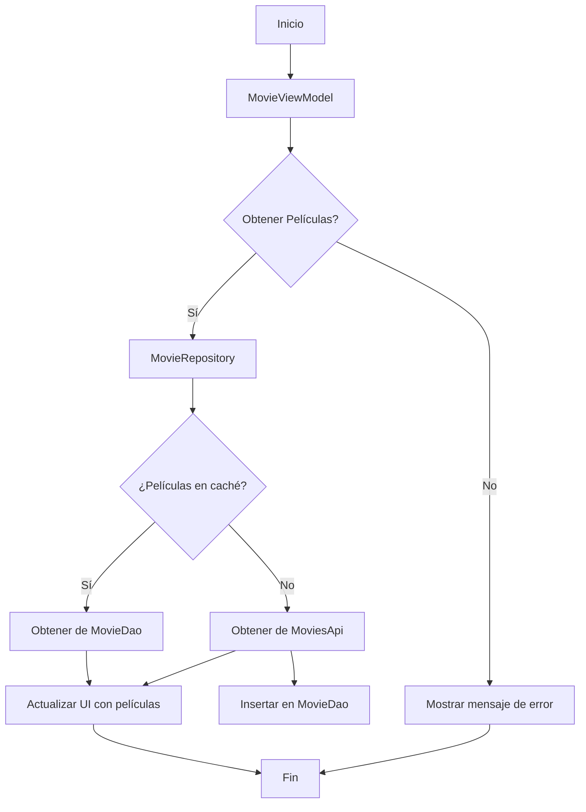

# TheMovieApp

## 🧠 Especificaciones Técnicas:
- Aplicación Android utilizando la siguiente URL de películas:

https://developer.themoviedb.org/docs/getting-started

- La aplicación tiene las siguientes condiciones:

1. Clean Architecture ✅
2. Arquitectura MVI ✅
3. Retrofit para llamado del API ✅
4. ROOM para almacenamiento local ✅
5. Inyección de dependencias con Koin ✅
6. Uso de Mappers ✅
7. Creación y uso de un custom view component que permita mostrar imagen y un texto ✅
8. Uso de recyclerView ✅
9. Uso de Glide para cargar imágenes ✅
10. Framework o librería a libre elección para testing ✅

### ✅ Validaciones a tomar en cuenta:
- La aplicación consulta la información de local (ROOM Database), y si no existe información para mostrar, deberá consultar remotamente (hacer llamada al API).
- Si el llamado al API es exitoso, se guardará la información en local y posteriormente se mostrará en la UI.
- Si el llamado al API falla, entonces mostrará:
- Un botón en el centro de la pantalla que dirá “Intentar nuevamente” que, al presionar, volverá a realizar la consulta al API, repitiendo nuevamente el paso 2.
- Realizar test de cada capa, función o escenario posible.

## 📈 Diagrama de flujo:

## 🐛 Pendientes: 

1. Corregir el bug de ROOM
2. Configurar Gradle para leer el API KEY desde las properties.
2. Separar la capa de ViewModel del repositorio, podría agregar una capa mas de casos de uso...
3. Agregar authentication para usar el API de forma correcta